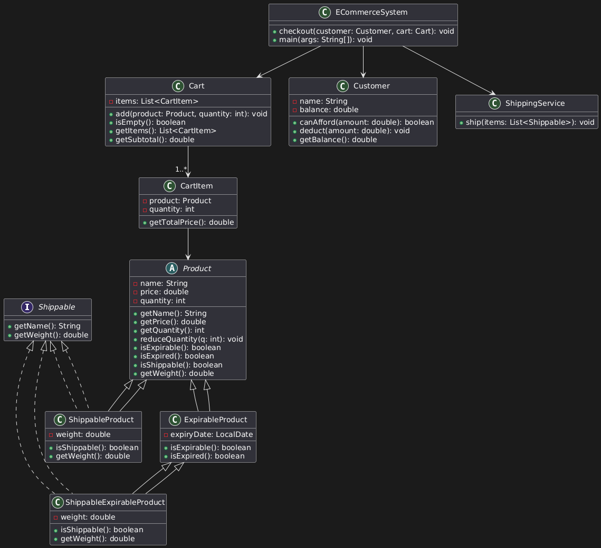

# E-commerce System

This project implements a simple e-commerce system with the following features:

## Features

- Product management with name, price, and quantity
- Support for different product types:
  - Regular products
  - Expirable products (e.g., Cheese, Biscuits)
  - Shippable products (e.g., TV)
  - Products that are both shippable and expirable (e.g., Cheese)
- Cart functionality to add products with specific quantities
- Checkout process with:
  - Subtotal calculation
  - Shipping fee calculation for shippable products
  - Total payment calculation
  - Balance verification
- Error handling for:
  - Empty cart
  - Insufficient balance
  - Expired products
  - Out of stock products
- Shipping service for products that require shipping

## Project Structure

```
ecommerce-system/
│
├── main/
│   ├── java/
│   │   └── com/
│   │       └── ecommerce/
│   │           ├── Main.java
│   │           │
│   │           ├── checkout/
│   │           │   └── ECommerceSystem.java
│   │           │
│   │           ├── model/
│   │           │   ├── Product.java
│   │           │   ├── ExpirableProduct.java
│   │           │   ├── ShippableProduct.java
│   │           │   ├── ShippableExpirableProduct.java
│   │           │   ├── CartItem.java
│   │           │   ├── Cart.java
│   │           │   ├── Customer.java
│   │           │   └── Shippable.java
│   │           │
│   │           └── service/
│               └── ShippingService.java
```

## UML Class Diagram

The following UML diagram illustrates the relationships between the classes in the e-commerce system:



The diagram shows:
- **Product** as the base class with common properties (name, price, quantity)
- **ExpirableProduct** extends Product with expiry date functionality
- **ShippableProduct** extends Product and implements Shippable interface
- **ShippableExpirableProduct** extends ExpirableProduct and implements Shippable interface
- **Shippable** interface defines methods for shippable items (getName, getWeight)
- **Cart** contains CartItem objects, which reference Product objects
- **Customer** has a balance and interacts with the checkout system
- **ECommerceSystem** orchestrates the checkout process using ShippingService

## Class Descriptions

- **Product**: Base class for all products with name, price, and quantity.
- **ExpirableProduct**: Products with an expiry date.
- **ShippableProduct**: Products that can be shipped, with weight information.
- **ShippableExpirableProduct**: Products that can both expire and be shipped.
- **CartItem**: Represents an item in the shopping cart with product and quantity.
- **Cart**: Collection of cart items with methods to add/remove products.
- **Customer**: Represents a customer with name and balance.
- **Shippable**: Interface implemented by products that can be shipped.
- **ShippingService**: Handles shipping of products.
- **ECommerceSystem**: Main class for the checkout process.

## Usage Example

```java
// Create products
ShippableExpirableProduct cheese = new ShippableExpirableProduct(
    "Cheese", 100.0, 10, LocalDate.now().plusDays(30), 0.2);
    
ShippableProduct tv = new ShippableProduct(
    "TV", 5000.0, 5, 15.0);
    
Product scratchCard = new Product(
    "Mobile Scratch Card", 50.0, 100);

// Create customer
Customer customer = new Customer("John Doe", 10000.0);

// Create cart
Cart cart = new Cart();

// Add products to cart
cart.add(cheese, 2);
cart.add(tv, 1);
cart.add(scratchCard, 1);

// Create e-commerce system and checkout
ECommerceSystem ecommerceSystem = new ECommerceSystem();
ecommerceSystem.checkout(customer, cart);
```

## Running the Application

### Method 1: Using Command Line (Recommended)

1. **Navigate to the project directory:**
   ```powershell
   cd "d:\fawry\oop-task"
   ```

2. **Compile all Java files:**
   ```powershell
   javac -d target main/java/com/ecommerce/*.java main/java/com/ecommerce/*/*.java
   ```

3. **Run the application:**
   ```powershell
   java -cp target com.ecommerce.Main
   ```

### Method 2: Step-by-Step Compilation

If you encounter issues, compile each package separately:

```powershell
# Create target directory
mkdir -Force target

# Compile model classes first
javac -d target main/java/com/ecommerce/model/*.java

# Compile service classes
javac -d target -cp target main/java/com/ecommerce/service/*.java

# Compile checkout classes
javac -d target -cp target main/java/com/ecommerce/checkout/*.java

# Compile main class
javac -d target -cp target main/java/com/ecommerce/Main.java

# Run the application
java -cp target com.ecommerce.Main
```

### Method 3: Using IDE

1. Open the project folder in your IDE (Eclipse, IntelliJ IDEA, or VS Code)
2. Set the `main/java` folder as the source directory
3. Run the `Main.java` file directly from the IDE

### Expected Output

The application demonstrates different scenarios:
1. **Successful checkout** - Shows checkout receipt with products, shipping notice, and payment processing
2. **Expired product error** - Demonstrates validation for expired products
3. **Insufficient balance error** - Shows error handling for insufficient customer balance
4. **Empty cart error** - Validates that cart is not empty before checkout

### Sample Output
```
Initial customer balance: 10000.0

=== Scenario 1: Successful Checkout ===
** Checkout receipt **
2x Cheese 200.0
1x TV 5000.0
1x Mobile Scratch Card 50.0
** Shipment notice **
1x Cheese 200g
1x Cheese 200g
1x TV 15000g
Total package weight 15.4kg
----------------------
Subtotal 5250.0
Shipping 480.0
Amount 5730.0
Remaining balance: 4270.0

=== Scenario 2: Expired Product ===
Error: Product Expired Milk is expired

=== Scenario 3: Insufficient Balance ===
Error: Insufficient balance

=== Scenario 4: Empty Cart ===
Error: Cannot checkout with an empty cart
```

## Assumptions

- Each product type is represented by a separate class inheriting from the base `Product` class
- Expiry dates are checked against the current system date
- Shipping cost is calculated based on the total weight of shippable items
- Customers can only add products to cart if sufficient quantity is available
- Products cannot be added to the cart multiple times (must be removed first to change quantity)

## Author

**Youssef Mohamed Saleh**

Fawry Quantum Internship Challenge Submission
